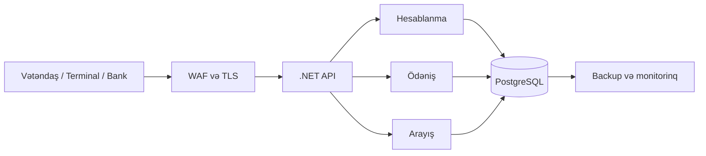

# Təqdimat ssenarisi

Təxminən 15–18 dəqiqəlik təqdimat üçün yoxlama siyahısı. Bütün şəxslər və maliyyə əməliyyatları sünidir. Təqdimat başlananda real ödəniş və real elektron identifikasiya aparılmadığını bildirin.

## Hazırlıq

- [ ] Asılılıqlar quraşdırılıb; `npm run lint`, `npm run typecheck`, `npm test`, `npm run build` və `npm start` uğurla tamamlanıb.
- [ ] [Ana səhifə](http://localhost:3000) və [inzibatçı paneli](http://localhost:3000/admin/dashboard) açılır.
- [ ] Brauzer geniş masaüstü ölçüsündədir; təqdimatın sonunda mobil görünüşü də göstərin.
- [ ] Başlanğıc ssenarisində `527418936204` kodunun balansı 41,04 ₼-dir. Əvvəlki sınaqlar balansı dəyişibsə, serveri dayandırıb `.demo/data.json` faylını silin və yenidən başladın.
- [ ] Demo OTP: `123456`. Heç bir real telefon nömrəsi, şəxsiyyət məlumatı və bank kartı daxil etməyin.

## 1. Vətəndaşa giriş — 2 dəqiqə

Ana səhifədə xidmət kartları, sürətli əməliyyatlar və üç addımlı istifadə qaydasını göstərin. Şəhər statistikalarının maket məlumatları olduğunu bildirin.

Tariflərə keçin:

- Zibil haqqı: qeydiyyatda olan hər sakin üçün 0,70 ₼.
- Mənzil haqqı: sənəddəki hər kvadratmetr üçün 0,15 ₼.
- Qeyri-yaşayış obyektlərində fərdi tarif və təsdiq ardıcıllığı.

## 2. Borc və ödəniş — 3 dəqiqə

1. “Borcu yoxla” səhifəsində `527418936204` daxil edin.
2. 4 sakin və 72,5 m² üçün aylıq sətirləri göstərin: 2,80 ₼ + 10,88 ₼ = 13,68 ₼.
3. İlkin ümumi borcun 41,04 ₼ olduğunu qeyd edin.
4. Ödənişi simulyasiya edin və təsdiqləyin.
5. Qəbzin əməliyyat nömrəsini və yenilənmiş balansı göstərin.
6. Səhifəni yeniləyin: nəticə yerli JSON faylında saxlandığı üçün qalır.

İctimai kod əmlaka bağlıdır və mülkiyyətçi dəyişdikdə də sabit qalır. İnzibatçı görünüşündə daxili kodun strukturunu göstərin: `SMQ-R-Z03-B0487-E02-F0125`.

## 3. Arayış və doğrulama — 2 dəqiqə

1. Arayış səhifəsinə keçin və eyni əmlak kodunu daxil edin.
2. SMS üsulunu seçib `123456` demo kodu ilə təsdiqləyin.
3. Sənəd nömrəsi, tarix, borc vəziyyəti və QR blokunu göstərin.
4. Doğrulama keçidini açın: yalnız məhdud məlumat və maskalanmış kod görünməlidir.
5. Yanlış sənəd identifikatoru ilə “tapılmadı/etibarsız” nəticəsini göstərin.

SİMA və ASAN düymələrinin məhsul axınını canlandırdığını, real identifikasiya provayderinə qoşulmadığını açıqlayın. Arayış hüquqi qüvvəsi olan rəsmi sənəd deyil.

## 4. İnzibatçı əməliyyatları — 6 dəqiqə

- [ ] **İdarə paneli:** əsas göstəricilər, aylıq yığım, ərazi borcları və əmlak növləri.
- [ ] **Binalar:** ərazi/küçə/status filtrləri, bina əlavə etmə və ya redaktə.
- [ ] **Əmlaklar:** ödəniş koduna görə axtarış, hesab-faktura tarixçəsi, sakin/mülkiyyətçi məlumatının maskalanması.
- [ ] **Sakinlər:** cari sakin sayı və sahə ilə əvvəlki dövrün saxlanmış göstəricilərini müqayisə edin; cari məlumatı dəyişdikdən sonra köhnə hesab-fakturanın məbləği sabit qalmalıdır.
- [ ] **Kommersiya obyektləri:** fərdi tarif təklifi və təsdiq vəziyyəti.
- [ ] **Hesablanma:** dövr seçimi və aylıq hesab-faktura yaratma. Snapshot həmin dövrün sakin, sahə və tarifini saxlayır.
- [ ] **Hesab-fakturalar:** dövr, əmlak və ödəniş statusu üzrə axtarış; sənəd detalları və hesablanma sətirləri.
- [ ] **Ödənişlər:** simulyasiya callback-i, əməliyyat nömrəsi və uzlaşma statusu.
- [ ] **Təkrar callback:** eyni tranzaksiya ikinci dəfə tətbiq edilməməlidir; əməliyyatdan əvvəlki və sonrakı balansı müqayisə edin.
- [ ] **Uzlaşdırma:** nümunə provayder hesabatını idxal edin; uyğun, uyğunsuz, çatışmayan və təkrar sətirləri göstərin.
- [ ] **Audit:** dəyişiklik üçün istifadəçi, əməl, əvvəlki/sonrakı dəyər və vaxt məlumatı.
- [ ] **Hesabatlar:** ay aralığı və ərazi seçimi, yığım/borc göstəriciləri və CSV faylının yüklənməsi.
- [ ] **Sazlamalar:** standart hesabat ayı, cədvəldə 8/16/32 sətir və sıxlıq seçimini dəyişib saxlayın. Səhifəni yeniləyin: seçimlər həmin brauzerdə qalır. İlkin seçimləri bərpa etmək düyməsini də göstərin.

## 5. Rollar və gələcək arxitektura — 2 dəqiqə

Altı rolun icazə matrisini göstərin: Super Admin, Finance Admin, Area Manager, Operator, Document Officer və Auditor. Rol seçimi demo görünüşüdür; həqiqi giriş nəzarəti deyil.

Arxitektura səhifəsində nəzərdə tutulan axını izah edin:

Bu diaqram gələcək istehsal arxitekturasıdır. Hazır prototip Next.js daxilində mock API və bir prosesə aid yerli JSON saxlanmasından istifadə edir. VPN, MFA, TLS, şifrələnmiş backup, dəyişdirilməz audit və OWASP ASVS nişanları hədəf tələblərdir; tətbiq edilmiş təhlükəsizlik təminatı kimi təqdim etməyin.

## Təqdimatdan sonra

- [ ] Səhifəni daraldaraq mobil menyu, kartlar, formalar və cədvəlləri göstərin.
- [ ] Dəstək formasının demo nəticəsini göstərin; real e-poçt/SMS çatdırılması yoxdur.
- [ ] README-də lokal işə salma, Docker, məlumat sıfırlama və .NET keçid planını açın.
- [ ] Növbəti mərhələ üçün real provayder, autentifikasiya, verilənlər bazası və istifadəçi qəbul sınaqlarının ayrıca inteqrasiya işi olduğunu qeyd edin.

Əgər demo başqa cihazdan açılacaqsa, lokal `localhost` QR keçidi həmin cihazda bu kompüterə aid deyil. Təqdimat üçün əlçatan eyni host ünvanını istifadə edin; inzibatçı ekranlarını autentifikasiya əlavə etmədən ictimai internetə açmayın.
